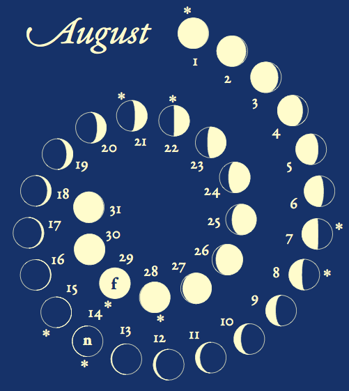

moon-poster:
============
This program makes a pretty lunar phase calendar, useful for planning night hikes.

For every day in the year, the calendar shows the lunar phase and marks full and new moons, along with friday and saturday nights.
At a glance, you can use it to plan weekend full-moon hikes.

All calculations are done in the local timezone, which is Pacific Standard Time for the examples shown here.
I believe the calculations are accurate, but please confirm them before using this for anything important.

examples:
---------

Here's an example of a full poster:

and a detail:

usage:
------
Making the poster is a two-step process: first, you run this python script to generate calendar data:

    python moon.py

You may need to edit the file to set the time zone or the range of years you want.

Next, you run tioga to make the poster:

    tioga moon.rb -s

Again, you will need to edit the file to set the year.
Alternatively, you can make a bunch of posters all at once:

    tioga make-plots.rb -l

colophon:
---------
The design is a blatant ripoff of something I saw at a friend's house.

I use the [pyephem](http://rhodesmill.org/pyephem/) python package to calculate lunar phases, and the wonderful [tioga](http://tioga.rubyforge.org/doc/) plotting package to lay out and typeset the poster.

The poster is typeset in the *Garamond Premier Pro* font by Robert Slimbach.
This is not included in the repo, so you may need to change the font in order to get it to compile.
Simply comment out the line

    t.tex_preview_preamble += "\n\t\\usepackage{GaramondPremierPro}\n"

or change it to your favorite pdflatex font package.
